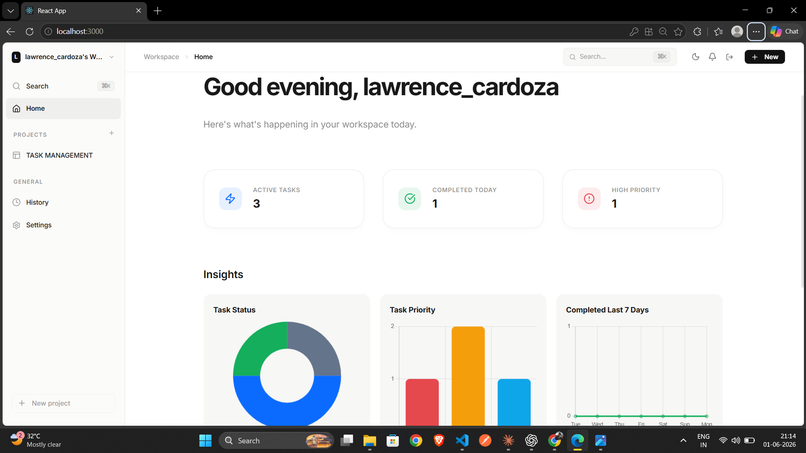
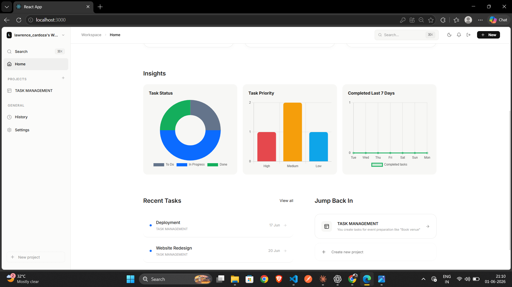
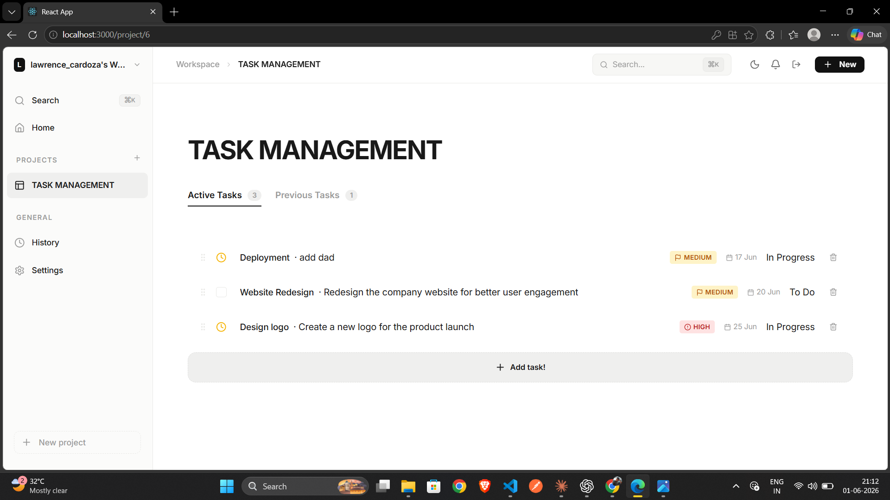
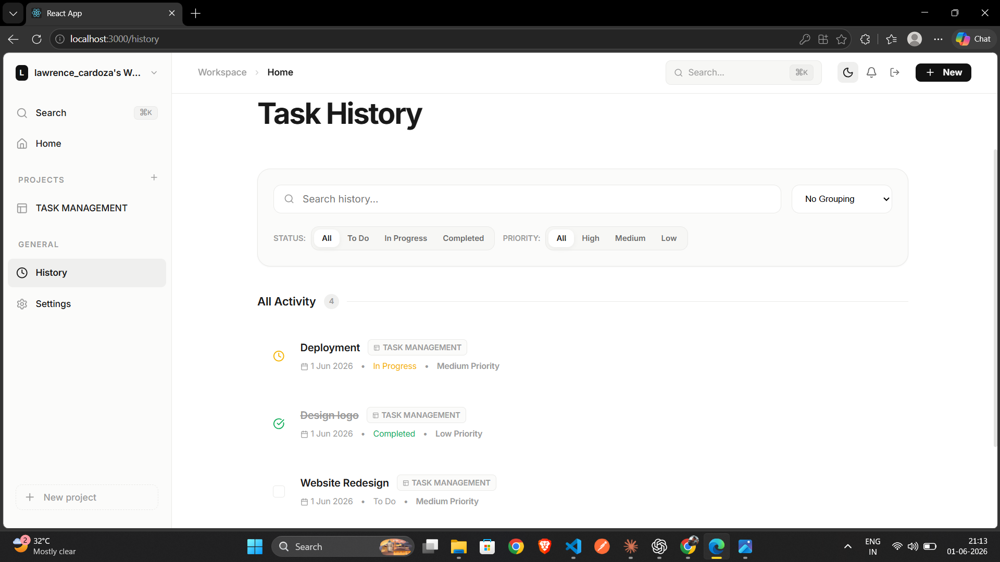

# 📋 Task Manager

> A full-stack task management application built with the **PERN Stack** (PostgreSQL, Express.js, React, Node.js). Organize projects, manage tasks, track priorities, and visualize productivity insights with an intuitive, modern interface.


## 🚀 Features

* User Authentication (JWT)
* Project Management
* Task Management
* Task Priorities & Status Tracking
* Search Tasks
* Dashboard Analytics
* Dark / Light Theme
* Responsive Design

## 🛠️ Tech Stack

### Frontend

* React
* React Router
* Axios
* Framer Motion
* Chart.js
* Lucide React

### Backend

* Node.js
* Express.js
* JWT Authentication
* bcryptjs

### Database

* PostgreSQL

## 📂 Project Structure

---

## 📂 Project Structure

```
task-manager/
├── client/                          # React frontend (Create React App)
│   ├── public/
│   │   ├── index.html
│   │   ├── manifest.json
│   │   └── robots.txt
│   ├── src/
│   │   ├── components/
│   │   │   ├── Assistant.jsx         # AI assistant panel (placeholder)
│   │   │   ├── DashboardCharts.jsx   # Chart visualizations
│   │   │   ├── DashboardHome.jsx     # Home dashboard
│   │   │   ├── HistoryView.jsx       # Task history view
│   │   │   ├── LoginModal.jsx        # Auth modal
│   │   │   ├── ProjectDashboard.jsx  # Project-specific view
│   │   │   ├── ProjectModal.jsx      # Create/edit projects
│   │   │   ├── SearchModal.jsx       # Command palette search
│   │   │   ├── SettingsView.jsx      # User settings
│   │   │   ├── Sidebar.jsx           # Navigation sidebar
│   │   │   └── TopBar.jsx            # Header bar
│   │   ├── context/
│   │   │   └── AuthContext.js        # Auth state & methods
│   │   ├── services/
│   │   │   └── api.js                # Axios instance & API calls
│   │   ├── App.js                    # Main app component
│   │   ├── index.js                  # React DOM entry
│   │   ├── App.css                   # Global styles
│   │   └── index.css                 # Base styles
│   ├── build/                        # Production build output
│   ├── package.json
│   ├── .env.example                  # Frontend env template
│   ├── netlify.toml                  # Netlify deployment config
│   └── README.md
│
├── server/                           # Express backend
│   ├── config/
│   │   └── db.js                     # Database connection (PG/SQLite)
│   ├── controllers/
│   │   ├── auth.controller.js        # Auth logic
│   │   ├── tasks.controller.js       # Task CRUD
│   │   └── projects.controller.js    # Project CRUD
│   ├── middleware/
│   │   ├── auth.js                   # JWT verification
│   │   └── errorHandler.js           # Error handling
│   ├── routes/
│   │   ├── auth.routes.js            # Auth endpoints
│   │   ├── tasks.routes.js           # Task endpoints
│   │   └── projects.routes.js        # Project endpoints
│   ├── data/
│   │   └── database.sqlite           # SQLite dev database
│   ├── server.js                     # Express app entry
│   ├── package.json
│   ├── .env                          # Environment variables (DO NOT COMMIT)
│   ├── .env.example                  # Env template
│   └── README.md
│
├── .gitignore                        # Git ignore rules
├── README.md                         # This file
└── package-lock.json
```


## 📸 

### Dashboard



### Tasks



### Analytics


## ⚙️ Installation

```bash
git clone <https://github.com/lawrencecardoza/task-manager.git>
cd task-manager

# Client
cd client
npm install
npm start

# Server
cd ../server
npm install
npm run dev
```

## 🔐 Environment Variables

Frontend:

```env
REACT_APP_API_URL=http://localhost:5000
```

Backend:

```env
PORT=5000
JWT_SECRET=your_secret
DATABASE_URL=your_database_url
```

## 👨‍💻 Author

Lawrence

Full Stack Web Developer


